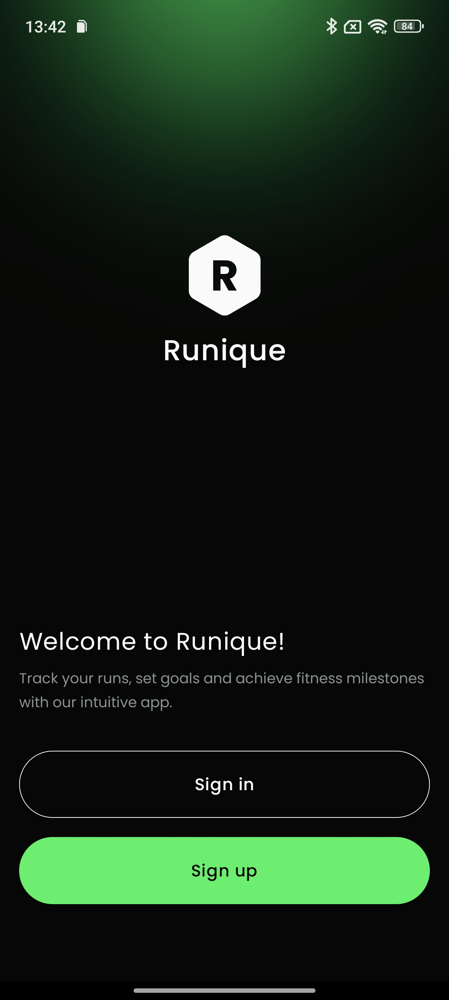
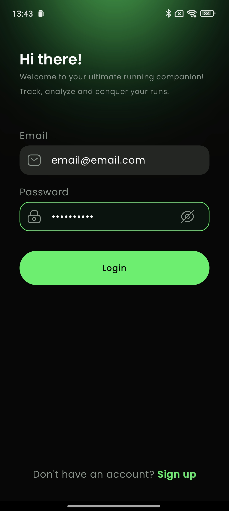
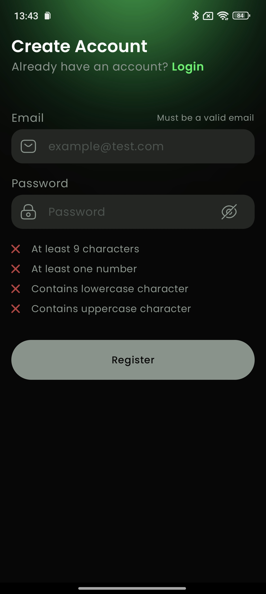
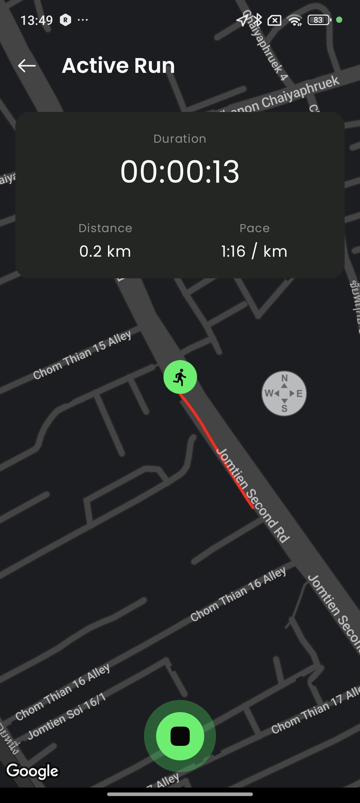
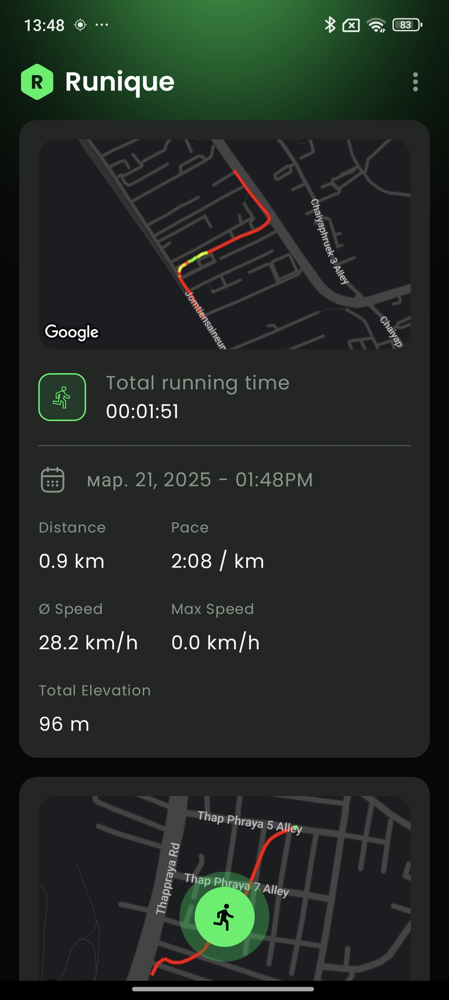

# RunningTracker

A modern Android application for tracking and analyzing your runs with a clean architecture approach
and a beautiful UI.

## Features

- **User Authentication**: Secure login and registration system
- **Run Tracking**: Track your runs with GPS, showing route on a map in real-time
- **Run Analytics**: Detailed statistics and analysis of your running performance
- **Offline Support**: Track runs without internet connection with background synchronization
- **Clean UI**: Modern and intuitive interface built with Jetpack Compose

## Architecture

The application follows Clean Architecture principles and is organized into multiple modules:

### App Module

The main application module that coordinates all other modules.

### Core Modules

- **core/data**: Core data functionality including networking and repository implementations
- **core/database**: Room database implementation for local storage
- **core/domain**: Business logic and entity definitions
- **core/presentation/designsystem**: Custom design system components
- **core/presentation/ui**: Shared UI utilities and components

### Feature Modules

- **auth**: Authentication feature (data, domain, presentation)
- **run**: Run tracking functionality (data, domain, location, network, presentation)
- **analytics**: Run analytics and statistics

## Tech Stack

- **UI**: Jetpack Compose
- **Architecture**: MVVM, Clean Architecture
- **Dependency Injection**: Koin
- **Database**: Room
- **Networking**: Ktor
- **Concurrency**: Kotlin Coroutines
- **Maps**: Google Maps SDK
- **Background Processing**: WorkManager
- **Build System**: Gradle with custom convention plugins

## Screenshots

<table>
  <tr>
    <td></td>
    <td></td>
    <td></td>
  </tr>
</table>

<table>
  <tr>
    <td></td>
    <td></td>
  </tr>
</table>
